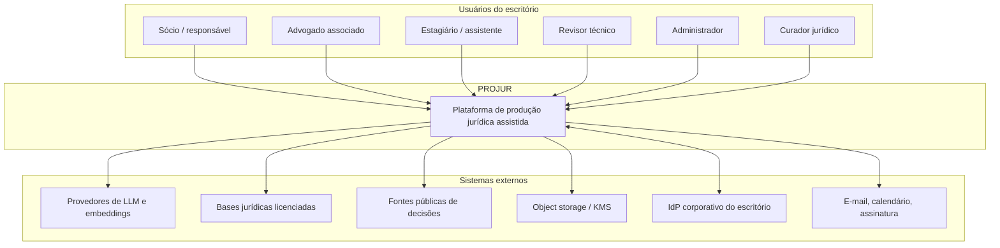
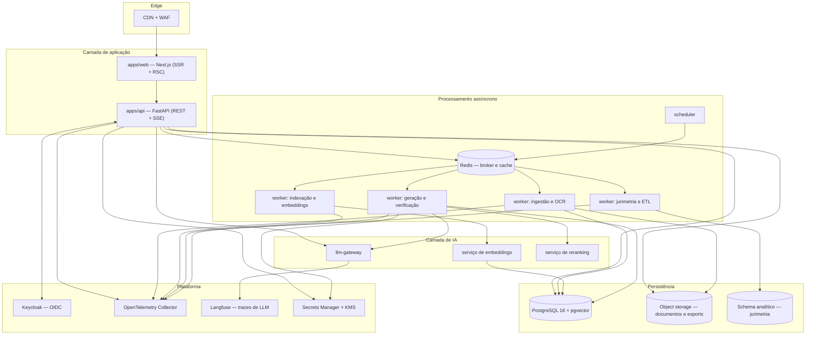
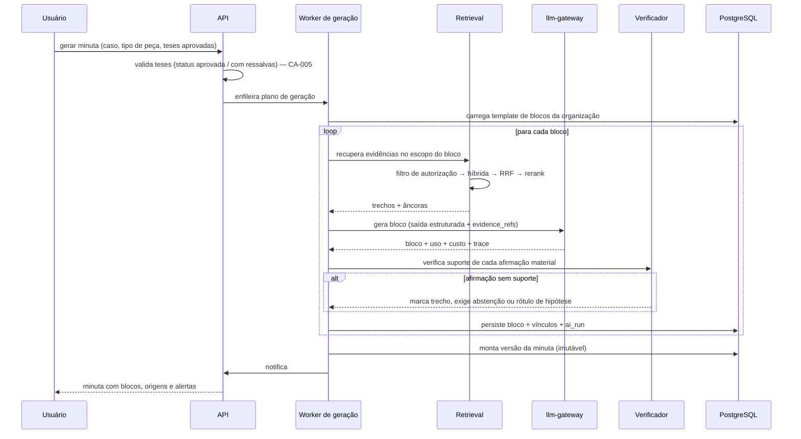
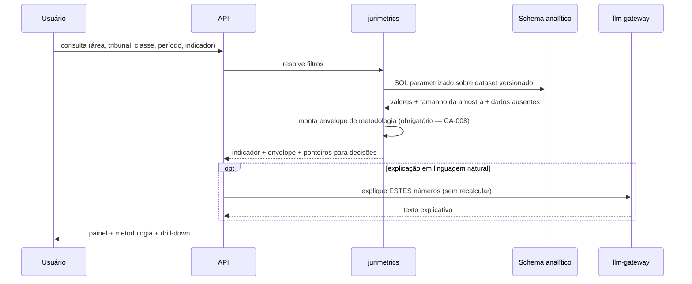

# 01 — Arquitetura de referência

## 1. Princípios arquiteturais

Cada princípio de produto da proposta (§2.3) tem uma contraparte arquitetural. A
tabela abaixo é o contrato entre concepção e engenharia.

| Princípio de produto (v0.1 §2.3) | Consequência arquitetural |
|---|---|
| Evidência antes da eloquência | Nenhum texto gerado trafega sem seu vetor de evidências; o transporte da resposta é um objeto estruturado, nunca uma string solta |
| Controle humano nos pontos críticos | Máquinas de estado explícitas no servidor; o cliente nunca decide transição |
| Separação entre fato, hipótese e decisão | Tipos distintos no modelo de dados, não um campo `status` em uma tabela genérica |
| Reutilização controlada | Promoção a ativo institucional é operação explícita, autorizada e auditada; nunca efeito colateral |
| Transparência de origem | Âncora de origem é coluna obrigatória, com constraint, não convenção |
| Segurança por padrão | Negação por omissão: a query sem contexto de tenant não retorna linhas, ela falha |
| IA capaz de reconhecer limites | Abstenção é um valor válido do schema de saída, não um caso de erro |
| Jurimetria explicável | O envelope de metodologia é parte do tipo de retorno do indicador |

## 2. Visão de contexto



O limite de confiança é a fronteira do PROJUR. Tudo que atravessa essa fronteira em
direção a `E1`, `E2` e `E6` está sujeito à política de saída de conteúdo confidencial
descrita em [07 §5](07-seguranca-e-privacidade.md).

## 3. Visão de contêineres



### 3.1 Responsabilidade de cada contêiner

| Contêiner | Responsabilidade | Explicitamente **não** faz |
|---|---|---|
| `apps/web` | Renderização, editor de peças, estados de IA, acessibilidade | Não decide autorização; não fala com provedores de LLM |
| `apps/api` | Autorização, transações, orquestração, streaming ao cliente | Não executa processamento longo; não chama modelo diretamente sem passar pelo gateway |
| Workers | Ingestão, OCR, indexação, geração multi-etapa, ETL | Não expõem porta HTTP pública |
| `llm-gateway` | Roteamento, retry, orçamento, redação de segredos, tracing, cache | Não contém lógica de domínio jurídico |
| PostgreSQL | Verdade transacional, vetores, RLS, auditoria | Não é usado como fila |
| Object storage | Originais imutáveis, derivados, exportações | Não é acessado direto pelo navegador sem URL assinada de curta duração |

## 4. Módulos de domínio

Os dez módulos da proposta (§4) viram módulos de código com fronteira explícita. O
monólito modular é intencional: microsserviços no MVP multiplicariam a superfície de
autorização — exatamente o que a invariante I-1 não tolera.

```
apps/api/src/projur/
├── identity/       # organizações, usuários, papéis, sessões        (E1)
├── authz/          # motor ABAC, políticas, barreiras éticas        (E1, E2)
├── matters/        # casos, equipes, prazos, sigilo, status         (E2)
├── documents/      # arquivos, versões, integridade, permissões     (E3)
├── ingest/         # extração, OCR, dedupe, classificação           (E3)
├── analysis/       # entidades, fatos, cronologia, lacunas          (E4)
├── evidence/       # âncoras, vínculos, propagação de impacto       (E4)
├── retrieval/      # busca híbrida, filtros, reranking              (E5)
├── knowledge/      # ativos institucionais, curadoria, validade     (E10)
├── theses/         # sugestão, requisitos, workflow de aprovação    (E6)
├── confrontation/  # objeções, fragilidades, respostas              (E7)
├── drafting/       # blocos, versões, editor, exportação            (E8)
├── quality/        # checklists, verificadores, gates               (E9)
├── jurimetrics/    # consultas, indicadores, drill-down             (E11)
├── audit/          # eventos, cadeia de hash, consulta              (E13)
├── analytics/      # métricas de produto, adoção, baseline          (E14)
└── admin/          # configuração por organização                   (E12)
```

**Regra de dependência**: módulos de domínio dependem de `authz`, `evidence` e
`audit`; nunca o contrário. Dependências cruzadas entre módulos de domínio passam por
interfaces de aplicação, não por acesso direto a tabelas alheias. Isso é verificado
por lint de import no CI.

## 5. Fluxos principais

### 5.1 Ingestão documental (assíncrona, RF-005 a RF-008)

```mermaid
sequenceDiagram
    participant U as Usuário
    participant API as API
    participant OBJ as Object storage
    participant Q as Fila
    participant W as Worker de ingestão
    participant PG as PostgreSQL

    U->>API: solicita upload (nome, tipo, caso)
    API->>API: autoriza (org, caso, papel)
    API->>OBJ: gera URL assinada (curta duração)
    API-->>U: URL + document_id (status: aguardando)
    U->>OBJ: envia arquivo diretamente
    U->>API: confirma envio
    API->>PG: registra documento + evento de auditoria
    API->>Q: enfileira job idempotente (chave = document_id + version)
    Q->>W: consome
    W->>OBJ: baixa original
    W->>W: verifica integridade (SHA-256), detecta MIME real
    W->>W: extrai texto; se camada ausente, OCR
    W->>W: avalia qualidade por página
    W->>W: detecta duplicidade (hash exato + MinHash)
    W->>W: classifica tipo documental (LLM, tier econômico)
    W->>PG: persiste páginas, texto, metadados, confiança
    W->>Q: encadeia job de indexação
    W->>PG: evento de auditoria (concluído / falha parcial)
    API-->>U: atualiza status via SSE
```

Pontos de projeto que decorrem de requisitos explícitos:

- **Upload direto ao storage** (não via API): evita saturar workers HTTP com arquivos
  grandes e reduz superfície de exposição do conteúdo.
- **Idempotência por chave determinística**: exigida por §10.3 ("tarefas assíncronas
  idempotentes, retentativas controladas e prevenção de duplicidade").
- **Estado por documento, nunca só por lote**: CA-012 exige que falha parcial não
  produza falsa impressão de completude. O lote agrega estados; não os substitui.
- **Classificação é sugestão, não verdade**: RF-008 e §4.2 exigem correção humana
  antes de os dados influenciarem teses ou minutas. O campo tem `confirmed_by` nulo
  até que alguém confirme, e o pipeline de teses filtra por confirmação conforme
  política da organização.

### 5.2 Geração de minuta por blocos (RF-018, §5.7)

A proposta é explícita: a peça é montada por blocos lógicos, "e não apenas por
geração integral em uma única resposta" (§4.6). Isso não é preferência estética — é o
que torna a atribuição verificável e o custo controlável.



O **verificador** é um componente próprio, não um trecho de prompt. Ele recebe o par
(afirmação, evidências recuperadas) e decide se a evidência sustenta a afirmação. Seu
detalhamento está em [05 §4](05-comportamento-da-ia-e-guardrails.md).

### 5.3 Consulta jurimétrica (RF-025, RF-026)



A LLM entra **depois** do número, nunca antes. Ela não tem acesso à ferramenta de
cálculo e não recebe os dados brutos: recebe o resultado agregado e o envelope. Essa
separação é a implementação da "regra crítica" de §7.5.

## 6. Comunicação e contratos

| Canal | Uso | Tecnologia |
|---|---|---|
| Cliente → API | Operações CRUD e comandos | REST/JSON, OpenAPI 3.1 gerado do código |
| API → Cliente (progresso) | Status de ingestão, geração em andamento | Server-Sent Events |
| API → Cliente (texto gerado) | Streaming de blocos | SSE com envelope estruturado por bloco |
| API → Workers | Trabalho longo | Celery sobre Redis, payload mínimo (só IDs) |
| Workers → Workers | Encadeamento de etapas | Assinaturas Celery (`chain`, `group`) |
| Serviços internos → observabilidade | Traces, métricas, logs | OpenTelemetry (OTLP) |

**REST e não GraphQL.** GraphQL move a composição da consulta para o cliente, o que
conflita com a invariante I-1: cada resolver vira um ponto onde a autorização precisa
ser reaplicada, e a superfície de erro cresce com a flexibilidade da query. Em um
sistema cujo pior defeito possível é vazamento entre clientes, endpoints explícitos
com autorização em um único ponto são a escolha correta. Revisitar apenas se houver
demanda concreta de agregação por clientes externos.

**Payload mínimo em fila.** Jobs carregam identificadores, não conteúdo. Conteúdo
confidencial não fica em Redis, o que reduz superfície e simplifica a política de
retenção.

## 7. Modos de falha e degradação

A proposta exige estados de interface para falha parcial (§8.4) e resiliência
(§10.3). A tabela define o comportamento esperado — é contrato de UX, não só de
infraestrutura.

| Falha | Comportamento do sistema | Experiência do usuário |
|---|---|---|
| Provedor de LLM indisponível | Gateway roteia para provedor alternativo do mesmo tier | Latência maior; modelo usado fica registrado no `ai_run` |
| Todos os provedores indisponíveis | Job permanece na fila com backoff; nada é inventado | "Geração indisponível no momento; seu trabalho está salvo" |
| OCR falha em N de M páginas | Documento fica `parcialmente_processado`; páginas ruins são marcadas | Aviso explícito de quais páginas não foram lidas — CA-012 |
| Reranker indisponível | Degrada para ordenação por RRF | Resultado ligeiramente pior, sinalizado no trace, não ao usuário |
| Serviço de embeddings indisponível | Indexação enfileirada; busca opera só no canal léxico | Aviso de que a base está sendo atualizada |
| Verificador indisponível | **Geração é bloqueada** | "Verificação de suporte indisponível; geração suspensa" |
| Banco em failover | API retorna 503 com retry-after; workers pausam | Aviso de manutenção |

A linha do verificador é deliberada e merece destaque: **é preferível não gerar a
gerar sem verificar**. Degradar a verificação transformaria o produto exatamente
naquilo que a proposta rejeita.

## 8. Requisitos não funcionais quantificados

A proposta define diretrizes qualitativas (§10.3). Aqui elas viram alvos mensuráveis,
com o cuidado de serem alvos de MVP e não de produto maduro.

| Dimensão | Alvo no MVP | Medição |
|---|---|---|
| Latência de leitura (p95) | < 400 ms | Métrica por endpoint no OTel |
| Busca híbrida + rerank (p95) | < 1,5 s para top-20 | Span dedicado |
| Primeiro token de geração de bloco (p95) | < 3 s | Métrica no gateway |
| Ingestão de PDF nativo de 50 páginas (p95) | < 90 s | Duração do job |
| Ingestão com OCR de 50 páginas (p95) | < 6 min | Duração do job |
| Disponibilidade | 99,0 % no piloto; 99,5 % em produção operacional | Uptime externo |
| RPO / RTO | RPO 15 min / RTO 4 h no piloto | Teste de restauração trimestral |
| Concorrência-alvo do piloto | 30 usuários ativos, 200 documentos/dia | Teste de carga |

Alvos de MVP menores que os de produto maduro são escolha consciente, autorizada pela
própria proposta ("o MVP pode iniciar com compromisso inferior ao produto maduro").
Elevá-los cedo custaria sprints que rendem mais em rastreabilidade.

---

**Anterior**: [00 — Sumário executivo](00-sumario-executivo.md) · **Próximo**: [02 — Stack tecnológico](02-stack-tecnologico.md)
