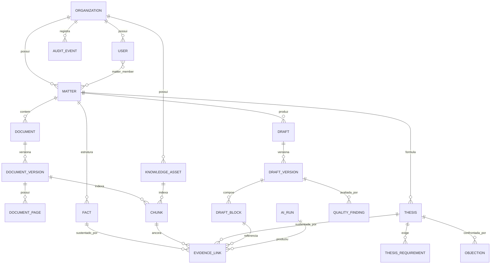
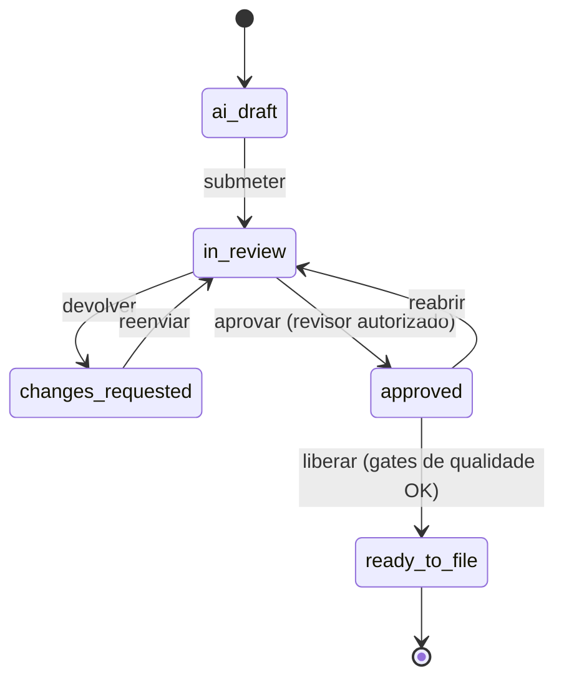

# 03 — Modelo de dados

## 1. Princípios do modelo

1. **`org_id` em toda tabela de domínio.** Sem exceção, inclusive em tabelas-folha.
   Redundância aqui é o que permite RLS uniforme e barata. Uma tabela sem `org_id` é
   uma tabela que a RLS não protege.
2. **Tipos distintos para naturezas epistêmicas distintas.** Fato, hipótese, tese
   aprovada e texto final não são estados de uma mesma tabela genérica. A proposta
   exige a distinção (§2.3); o schema a torna estrutural.
3. **Imutabilidade onde há valor probatório.** Versões de minuta, eventos de auditoria
   e execuções de IA são append-only. Correção se faz por nova versão, nunca por
   `UPDATE`.
4. **Âncora de origem como coluna com constraint.** `document_id + page + char_span` é
   obrigatório em todo chunk e propagado a todo vínculo de evidência.
5. **Exclusão lógica com política de retenção explícita**, exceto quando houver
   obrigação de eliminação — e nesse caso a eliminação é física e registrada.

## 2. Diagrama de entidades



## 3. DDL essencial

O recorte abaixo cobre as decisões que não são óbvias. O schema completo vive nas
migrações Alembic.

### 3.1 Organização, identidade e RLS

```sql
CREATE TABLE organization (
    id              uuid PRIMARY KEY DEFAULT gen_random_uuid(),
    name            text NOT NULL,
    slug            citext NOT NULL UNIQUE,
    isolation_tier  text NOT NULL DEFAULT 'shared'
                    CHECK (isolation_tier IN ('shared', 'dedicated')),
    retention_policy jsonb NOT NULL DEFAULT '{}'::jsonb,
    external_ai_allowed boolean NOT NULL DEFAULT false,
    created_at      timestamptz NOT NULL DEFAULT now()
);

CREATE TABLE app_user (
    id              uuid PRIMARY KEY DEFAULT gen_random_uuid(),
    org_id          uuid NOT NULL REFERENCES organization(id),
    subject         text NOT NULL,              -- 'sub' do OIDC
    email           citext NOT NULL,
    display_name    text NOT NULL,
    role            text NOT NULL CHECK (role IN (
                      'socio','associado','assistente','revisor','admin','curador')),
    status          text NOT NULL DEFAULT 'active',
    created_at      timestamptz NOT NULL DEFAULT now(),
    UNIQUE (org_id, subject),
    UNIQUE (org_id, email)
);

-- Contexto de tenant: setado por conexão, no início de cada transação.
CREATE OR REPLACE FUNCTION current_org_id() RETURNS uuid
LANGUAGE sql STABLE AS $$
    SELECT NULLIF(current_setting('projur.org_id', true), '')::uuid
$$;
```

**Como o contexto é setado.** A cada requisição autenticada, a camada de sessão
executa `SET LOCAL projur.org_id = ...` e `SET LOCAL projur.user_id = ...` dentro da
transação, a partir do token validado — nunca a partir de parâmetro enviado pelo
cliente. `SET LOCAL` garante que o contexto morre com a transação, o que evita
vazamento entre requisições que reusam a mesma conexão do pool. A aplicação conecta
com um papel **sem** `BYPASSRLS`; apenas migrações e rotinas de manutenção usam papel
privilegiado.

Se `projur.org_id` não estiver setado, `current_org_id()` retorna `NULL` e as
políticas não casam: a query retorna zero linhas. Negação por omissão, como exige o
princípio de segurança por padrão.

### 3.2 Casos e barreiras de acesso

```sql
CREATE TABLE matter (
    id              uuid PRIMARY KEY DEFAULT gen_random_uuid(),
    org_id          uuid NOT NULL REFERENCES organization(id),
    client_ref      text NOT NULL,
    title           text NOT NULL,
    practice_area   text NOT NULL,
    phase           text,
    opposing_party  text,
    deadline_at     timestamptz,
    confidentiality text NOT NULL DEFAULT 'standard'
                    CHECK (confidentiality IN ('standard','restricted','ethical_wall')),
    status          text NOT NULL DEFAULT 'active',
    created_by      uuid NOT NULL REFERENCES app_user(id),
    created_at      timestamptz NOT NULL DEFAULT now(),
    archived_at     timestamptz
);

CREATE TABLE matter_member (
    matter_id       uuid NOT NULL REFERENCES matter(id) ON DELETE CASCADE,
    user_id         uuid NOT NULL REFERENCES app_user(id),
    org_id          uuid NOT NULL REFERENCES organization(id),
    matter_role     text NOT NULL CHECK (matter_role IN
                      ('lead','contributor','reviewer','observer')),
    granted_by      uuid NOT NULL REFERENCES app_user(id),
    granted_at      timestamptz NOT NULL DEFAULT now(),
    PRIMARY KEY (matter_id, user_id)
);

-- Barreira ética: proibição explícita vence qualquer concessão.
CREATE TABLE ethical_wall (
    id              uuid PRIMARY KEY DEFAULT gen_random_uuid(),
    org_id          uuid NOT NULL REFERENCES organization(id),
    matter_id       uuid REFERENCES matter(id),
    client_ref      text,
    blocked_user_id uuid REFERENCES app_user(id),
    blocked_group   text,
    reason          text NOT NULL,
    created_by      uuid NOT NULL REFERENCES app_user(id),
    created_at      timestamptz NOT NULL DEFAULT now(),
    CHECK (matter_id IS NOT NULL OR client_ref IS NOT NULL),
    CHECK (blocked_user_id IS NOT NULL OR blocked_group IS NOT NULL)
);
```

Barreiras éticas são **negações**, e negação sempre vence concessão na avaliação de
política. Modelar como negação explícita — em vez de simplesmente não conceder acesso
— permite responder à pergunta de auditoria "por que esta pessoa não vê este caso?"
com uma linha do banco, e não com a ausência de uma linha.

### 3.3 Documentos, páginas e qualidade

```sql
CREATE TABLE document (
    id              uuid PRIMARY KEY DEFAULT gen_random_uuid(),
    org_id          uuid NOT NULL REFERENCES organization(id),
    matter_id       uuid NOT NULL REFERENCES matter(id),
    title           text NOT NULL,
    doc_type        text,                        -- classificação sugerida
    doc_type_source text CHECK (doc_type_source IN ('ai','human','import')),
    confirmed_by    uuid REFERENCES app_user(id), -- RF-008: correção humana
    confirmed_at    timestamptz,
    source          text,
    created_at      timestamptz NOT NULL DEFAULT now(),
    deleted_at      timestamptz
);

CREATE TABLE document_version (
    id              uuid PRIMARY KEY DEFAULT gen_random_uuid(),
    org_id          uuid NOT NULL REFERENCES organization(id),
    document_id     uuid NOT NULL REFERENCES document(id),
    version_no      int  NOT NULL,
    storage_key     text NOT NULL,
    sha256          bytea NOT NULL,
    byte_size       bigint NOT NULL,
    mime_type       text NOT NULL,
    page_count      int,
    extraction_status text NOT NULL DEFAULT 'pending'
                    CHECK (extraction_status IN
                      ('pending','processing','completed','partial','failed')),
    extraction_report jsonb,     -- páginas falhas, motivos, confiança — CA-012
    duplicate_of    uuid REFERENCES document_version(id),   -- RF-007
    near_duplicate_score real,
    created_at      timestamptz NOT NULL DEFAULT now(),
    UNIQUE (document_id, version_no)
);

CREATE TABLE document_page (
    id              uuid PRIMARY KEY DEFAULT gen_random_uuid(),
    org_id          uuid NOT NULL REFERENCES organization(id),
    document_version_id uuid NOT NULL REFERENCES document_version(id),
    page_no         int NOT NULL,
    text            text,
    ocr_applied     boolean NOT NULL DEFAULT false,
    quality_score   real,        -- 0..1
    quality_flags   text[] NOT NULL DEFAULT '{}',
    UNIQUE (document_version_id, page_no)
);
```

`extraction_status = 'partial'` existe por causa de CA-012. Sem esse estado, o
sistema só poderia dizer "concluído" ou "falhou", e um lote com três páginas
ilegíveis apareceria como sucesso — precisamente a falsa impressão de completude que
o critério proíbe.

### 3.4 Chunks e índice vetorial

```sql
CREATE TABLE chunk (
    id              uuid PRIMARY KEY DEFAULT gen_random_uuid(),
    org_id          uuid NOT NULL REFERENCES organization(id),
    matter_id       uuid,          -- nulo para ativos institucionais e fontes externas
    scope           text NOT NULL CHECK (scope IN
                      ('matter_document','knowledge_asset','external_source')),
    source_ref      uuid NOT NULL, -- document_version_id | knowledge_asset_id | source_doc_id
    parent_chunk_id uuid REFERENCES chunk(id),   -- small-to-big
    ordinal         int  NOT NULL,
    text            text NOT NULL,
    token_count     int  NOT NULL,

    -- Âncora de origem: obrigatória (CA-004)
    page_from       int,
    page_to         int,
    char_start      int NOT NULL,
    char_end        int NOT NULL,

    -- Metadados de filtro (v0.1 §6.3)
    practice_area   text,
    jurisdiction    text,
    court           text,
    doc_date        date,
    confidentiality text NOT NULL DEFAULT 'standard',
    valid_until     date,
    metadata        jsonb NOT NULL DEFAULT '{}'::jsonb,

    -- Versionamento do espaço vetorial
    embedding_model_id text NOT NULL,
    embedding_version  int  NOT NULL,
    embedding       vector(1024) NOT NULL,
    tsv             tsvector GENERATED ALWAYS AS
                      (to_tsvector('portuguese', unaccent(text))) STORED,

    created_at      timestamptz NOT NULL DEFAULT now(),
    CHECK (char_end > char_start)
);

-- Índice vetorial particionado pelo espaço de embedding em uso.
CREATE INDEX chunk_embedding_hnsw
    ON chunk USING hnsw (embedding vector_cosine_ops)
    WITH (m = 16, ef_construction = 64);

CREATE INDEX chunk_tsv_gin      ON chunk USING gin (tsv);
CREATE INDEX chunk_org_scope    ON chunk (org_id, scope, matter_id);
CREATE INDEX chunk_filters      ON chunk (org_id, practice_area, jurisdiction, doc_date);
CREATE INDEX chunk_trgm         ON chunk USING gin (text gin_trgm_ops);
```

Três decisões merecem justificativa:

- **`scope` explícito em vez de tabelas separadas por base.** A proposta define quatro
  bases de recuperação (§6.2) com regras distintas. Uma tabela única com `scope` e
  metadados uniformes permite uma **única** implementação do filtro de autorização.
  Quatro tabelas significariam quatro caminhos de código onde a invariante I-1 poderia
  ser violada de forma diferente.
- **`parent_chunk_id` para recuperação *small-to-big*.** Busca-se sobre trechos
  pequenos (melhor precisão semântica) e entrega-se ao modelo o trecho pai maior
  (melhor contexto). Detalhado em [04 §4](04-pipeline-rag.md).
- **`tsvector` gerado com `unaccent`.** Documentos jurídicos brasileiros combinam
  acentuação inconsistente com termos técnicos exatos. Normalizar na coluna gerada
  evita divergência entre indexação e consulta.

### 3.5 Fatos, evidências e propagação de impacto

```sql
CREATE TABLE fact (
    id              uuid PRIMARY KEY DEFAULT gen_random_uuid(),
    org_id          uuid NOT NULL REFERENCES organization(id),
    matter_id       uuid NOT NULL REFERENCES matter(id),
    statement       text NOT NULL,
    occurred_on     date,
    epistemic_type  text NOT NULL CHECK (epistemic_type IN
                      ('extracted','inferred')),        -- v0.1 §11.1
    status          text NOT NULL DEFAULT 'proposed' CHECK (status IN
                      ('proposed','confirmed','rejected','superseded')),
    confidence      real,
    confirmed_by    uuid REFERENCES app_user(id),
    confirmed_at    timestamptz,
    created_by_ai_run uuid REFERENCES ai_run(id),
    created_at      timestamptz NOT NULL DEFAULT now()
);

-- Vínculo universal entre uma afirmação e o trecho que a sustenta ou contradiz.
CREATE TABLE evidence_link (
    id              uuid PRIMARY KEY DEFAULT gen_random_uuid(),
    org_id          uuid NOT NULL REFERENCES organization(id),
    matter_id       uuid,
    subject_type    text NOT NULL CHECK (subject_type IN
                      ('fact','thesis','objection','draft_block','indicator')),
    subject_id      uuid NOT NULL,
    chunk_id        uuid REFERENCES chunk(id),
    external_ref    jsonb,                    -- fonte externa identificada
    relation        text NOT NULL CHECK (relation IN ('supports','contradicts','contextualizes')),
    relevance       real,
    created_by_ai_run uuid REFERENCES ai_run(id),
    verified_by     uuid REFERENCES app_user(id),
    created_at      timestamptz NOT NULL DEFAULT now(),
    CHECK (chunk_id IS NOT NULL OR external_ref IS NOT NULL)
);

CREATE INDEX evidence_subject ON evidence_link (org_id, subject_type, subject_id);
CREATE INDEX evidence_chunk   ON evidence_link (chunk_id);
```

`evidence_link` é a espinha dorsal de CA-004. A constraint final garante que **não
existe vínculo sem origem**: ou aponta para um chunk interno, ou traz referência
externa identificável. Não há terceira possibilidade.

**Propagação de impacto (CA-010).** Quando um fato confirmado muda, tudo que dele
depende precisa ser sinalizado. Como `evidence_link` registra o grafo, a consulta é
direta:

```sql
-- Quais teses e blocos dependem deste fato?
WITH RECURSIVE impacted AS (
    SELECT subject_type, subject_id
      FROM evidence_link
     WHERE org_id = current_org_id()
       AND chunk_id IN (SELECT chunk_id FROM evidence_link
                         WHERE subject_type = 'fact' AND subject_id = $1)
    UNION
    SELECT e.subject_type, e.subject_id
      FROM evidence_link e
      JOIN impacted i ON e.chunk_id IS NOT NULL AND e.subject_id = i.subject_id
)
SELECT * FROM impacted;
```

Na alteração de um fato, a API abre `impact_flag` em cada dependente. O item afetado
aparece na interface com o aviso "depende de um fato que mudou" até que alguém revise.
O sistema **não** corrige automaticamente: correção silenciosa em cascata violaria o
princípio de controle humano nos pontos críticos.

### 3.6 Teses e workflow de aprovação

```sql
CREATE TABLE thesis (
    id              uuid PRIMARY KEY DEFAULT gen_random_uuid(),
    org_id          uuid NOT NULL REFERENCES organization(id),
    matter_id       uuid NOT NULL REFERENCES matter(id),
    title           text NOT NULL,
    statement       text NOT NULL,
    legal_basis     jsonb NOT NULL DEFAULT '[]'::jsonb,
    status          text NOT NULL DEFAULT 'proposed' CHECK (status IN
                      ('proposed','under_review','approved',
                       'approved_with_caveats','rejected','pending_information')),
    caveats         text,
    risk_notes      text,
    decided_by      uuid REFERENCES app_user(id),
    decided_at      timestamptz,
    decision_rationale text,
    created_by_ai_run uuid REFERENCES ai_run(id),
    created_at      timestamptz NOT NULL DEFAULT now(),
    CHECK (status NOT IN ('approved','approved_with_caveats','rejected')
           OR (decided_by IS NOT NULL AND decided_at IS NOT NULL))
);
```

A última `CHECK` é a implementação em banco de "registrar responsável, data,
justificativa e versão da aprovação" (§4.4). Uma tese não consegue estar aprovada sem
que exista um humano responsável pela aprovação — não por disciplina de equipe, mas
porque o banco recusa a linha.

### 3.7 Minutas, blocos e imutabilidade

```sql
CREATE TABLE draft_version (
    id              uuid PRIMARY KEY DEFAULT gen_random_uuid(),
    org_id          uuid NOT NULL REFERENCES organization(id),
    draft_id        uuid NOT NULL REFERENCES draft(id),
    version_no      int  NOT NULL,
    parent_version_id uuid REFERENCES draft_version(id),
    state           text NOT NULL DEFAULT 'ai_draft' CHECK (state IN
                      ('ai_draft','in_review','changes_requested',
                       'approved','ready_to_file')),
    created_by      uuid NOT NULL REFERENCES app_user(id),
    created_at      timestamptz NOT NULL DEFAULT now(),
    approved_by     uuid REFERENCES app_user(id),
    approved_at     timestamptz,
    UNIQUE (draft_id, version_no),
    CHECK (state <> 'ready_to_file' OR approved_by IS NOT NULL)   -- CA-007
);

CREATE TABLE draft_block (
    id              uuid PRIMARY KEY DEFAULT gen_random_uuid(),
    org_id          uuid NOT NULL REFERENCES organization(id),
    draft_version_id uuid NOT NULL REFERENCES draft_version(id),
    ordinal         int  NOT NULL,
    block_type      text NOT NULL,      -- 'fatos','fundamentos','pedidos', ...
    content         jsonb NOT NULL,     -- documento ProseMirror com marcas de evidência
    thesis_id       uuid REFERENCES thesis(id),
    generated_by_ai_run uuid REFERENCES ai_run(id),
    edited_by_human boolean NOT NULL DEFAULT false,
    verification    jsonb,              -- resultado do verificador de suporte
    UNIQUE (draft_version_id, ordinal)
);
```

Versões são imutáveis: qualquer edição cria nova `draft_version` com
`parent_version_id` apontando para a anterior (CA-006). O diff entre versões é
calculado sob demanda, não armazenado.

**Trigger que impõe CA-005** — tese rejeitada não entra em minuta:

```sql
CREATE OR REPLACE FUNCTION enforce_thesis_approval() RETURNS trigger
LANGUAGE plpgsql AS $$
DECLARE v_status text;
BEGIN
    IF NEW.thesis_id IS NULL THEN RETURN NEW; END IF;
    SELECT status INTO v_status FROM thesis WHERE id = NEW.thesis_id;
    IF v_status IN ('rejected','proposed','pending_information') THEN
        RAISE EXCEPTION
          'CA-005: bloco referencia tese em status % (id %)', v_status, NEW.thesis_id;
    END IF;
    RETURN NEW;
END $$;

CREATE TRIGGER trg_enforce_thesis_approval
    BEFORE INSERT OR UPDATE ON draft_block
    FOR EACH ROW EXECUTE FUNCTION enforce_thesis_approval();
```

A regra vive também na camada de aplicação, com mensagem de erro adequada ao usuário.
Duplicá-la no banco é deliberado: a camada de aplicação dá a boa experiência, o banco
dá a garantia.

### 3.8 Execuções de IA e auditoria

```sql
CREATE TABLE ai_run (
    id              uuid PRIMARY KEY DEFAULT gen_random_uuid(),
    org_id          uuid NOT NULL REFERENCES organization(id),
    matter_id       uuid,
    user_id         uuid REFERENCES app_user(id),
    purpose         text NOT NULL,          -- 'classify','extract','suggest_thesis', ...
    tier            text NOT NULL,
    provider        text NOT NULL,
    model_id        text NOT NULL,
    prompt_template_id text NOT NULL,
    prompt_version  int  NOT NULL,
    params          jsonb NOT NULL DEFAULT '{}'::jsonb,
    retrieved_chunk_ids uuid[] NOT NULL DEFAULT '{}',
    output_ref      text,                   -- chave no storage; conteúdo não fica inline
    input_tokens    int,
    output_tokens   int,
    cost_usd        numeric(12,6),
    latency_ms      int,
    outcome         text NOT NULL CHECK (outcome IN
                      ('ok','abstained','policy_blocked','error')),
    trace_id        text,
    created_at      timestamptz NOT NULL DEFAULT now()
);

CREATE TABLE audit_event (
    id              bigserial PRIMARY KEY,
    org_id          uuid NOT NULL REFERENCES organization(id),
    occurred_at     timestamptz NOT NULL DEFAULT now(),
    actor_user_id   uuid REFERENCES app_user(id),
    actor_ip        inet,
    action          text NOT NULL,          -- 'document.export','thesis.approve', ...
    resource_type   text NOT NULL,
    resource_id     uuid,
    matter_id       uuid,
    payload         jsonb NOT NULL DEFAULT '{}'::jsonb,
    prev_hash       bytea,
    entry_hash      bytea NOT NULL
);

REVOKE UPDATE, DELETE ON audit_event FROM projur_app;
```

`ai_run` atende RF-028 integralmente: modelo, versão, parâmetros, trechos
recuperados, resultado, custo e latência. É a base tanto da auditoria quanto do
controle de custo. O conteúdo gerado fica no storage e não na linha, para não inflar o
banco e para permitir política de retenção própria.

O encadeamento de hash de `audit_event` está detalhado em
[ADR-0007](../adr/0007-auditoria-append-only-com-encadeamento-de-hash.md).

## 4. Row-Level Security

```sql
ALTER TABLE matter        ENABLE ROW LEVEL SECURITY;
ALTER TABLE document      ENABLE ROW LEVEL SECURITY;
ALTER TABLE chunk         ENABLE ROW LEVEL SECURITY;
ALTER TABLE fact          ENABLE ROW LEVEL SECURITY;
ALTER TABLE thesis        ENABLE ROW LEVEL SECURITY;
ALTER TABLE draft_version ENABLE ROW LEVEL SECURITY;
ALTER TABLE evidence_link ENABLE ROW LEVEL SECURITY;
ALTER TABLE ai_run        ENABLE ROW LEVEL SECURITY;
ALTER TABLE audit_event   ENABLE ROW LEVEL SECURITY;
-- ... todas as tabelas de domínio

ALTER TABLE matter FORCE ROW LEVEL SECURITY;

CREATE POLICY org_isolation ON matter
    USING (org_id = current_org_id())
    WITH CHECK (org_id = current_org_id());

-- Chunks: isolamento por organização E por caso, quando o chunk pertence a um caso.
CREATE POLICY chunk_isolation ON chunk
    USING (
        org_id = current_org_id()
        AND (
            matter_id IS NULL                    -- ativo institucional / fonte externa
            OR matter_id IN (
                SELECT m.id FROM matter m
                 WHERE m.org_id = current_org_id()
                   AND (
                     EXISTS (SELECT 1 FROM matter_member mm
                              WHERE mm.matter_id = m.id
                                AND mm.user_id = current_user_id())
                   )
                   AND NOT EXISTS (
                     SELECT 1 FROM ethical_wall w
                      WHERE w.org_id = current_org_id()
                        AND (w.matter_id = m.id OR w.client_ref = m.client_ref)
                        AND w.blocked_user_id = current_user_id()
                   )
            )
        )
    );
```

`FORCE ROW LEVEL SECURITY` faz a política valer inclusive para o dono da tabela — sem
isso, uma conexão que por engano use um papel privilegiado ignoraria a proteção
inteira. Testes de RLS rodam com um papel de aplicação real, não com superusuário;
caso contrário, testariam nada.

**RLS não substitui a autorização na aplicação.** Ela é a segunda camada. A primeira
decide *o que perguntar*; a RLS garante que, mesmo com uma pergunta errada, a
resposta não vaze. A justificativa completa está em
[ADR-0003](../adr/0003-isolamento-multitenant-em-duas-camadas.md).

## 5. Máquinas de estado



Transições são implementadas em um único módulo, no servidor, com uma tabela de
transições permitidas por papel. O cliente envia comandos (`submit`, `approve`),
nunca o estado desejado. Toda transição emite `audit_event` na **mesma transação** da
mutação — se o evento falhar, a transição também falha (I-4).

O caminho `approved → ready_to_file` avalia os gates de qualidade
([05 §5](05-comportamento-da-ia-e-guardrails.md)); qualquer achado bloqueante impede a
transição e retorna a lista de pendências (CA-007).

## 6. Estratégia de índices e desempenho

| Consulta | Índice |
|---|---|
| Busca vetorial filtrada por caso | HNSW + pré-filtro por `(org_id, scope, matter_id)` |
| Busca léxica | GIN sobre `tsv` |
| Busca por termo aproximado (nomes, grafias divergentes) | GIN trigram |
| Linha do tempo do caso | `(org_id, matter_id, occurred_on)` |
| Auditoria por recurso | `(org_id, resource_type, resource_id, occurred_at DESC)` |
| Custo por organização/período | `(org_id, created_at)` em `ai_run` + agregação materializada |

**Sobre pré-filtro em índice HNSW**: filtro seletivo demais degrada a recuperação
aproximada, porque o grafo é percorrido e depois filtrado. Mitigação: para casos com
poucos documentos, o planejador escolhe varredura exata (barata nesse volume); para
organizações grandes, avalia-se índice particionado por `matter_id`. Isso é medido no
teste de carga da Sprint 3, não presumido.

## 7. Retenção e eliminação

| Dado | Retenção padrão | Observação |
|---|---|---|
| Documento original | Enquanto o caso existir + período contratual | Object Lock quando exigido |
| Texto extraído e chunks | Igual ao documento | Eliminados junto |
| Versões de minuta | Permanente enquanto o caso existir | Valor probatório |
| `ai_run` (metadados) | 24 meses | Sem conteúdo inline |
| Saída de IA (conteúdo) | 12 meses, configurável | Storage separado |
| `audit_event` | 5 anos, configurável | Append-only + exportação WORM |
| Traces de LLM | 90 dias | Com redação de conteúdo sensível |

Eliminação atende a obrigações legais e contratuais e é executada por job dedicado,
que registra em auditoria o que eliminou, quando e sob qual política — o registro da
eliminação sobrevive à eliminação.

---

**Anterior**: [02 — Stack](02-stack-tecnologico.md) · **Próximo**: [04 — Pipeline RAG](04-pipeline-rag.md)
