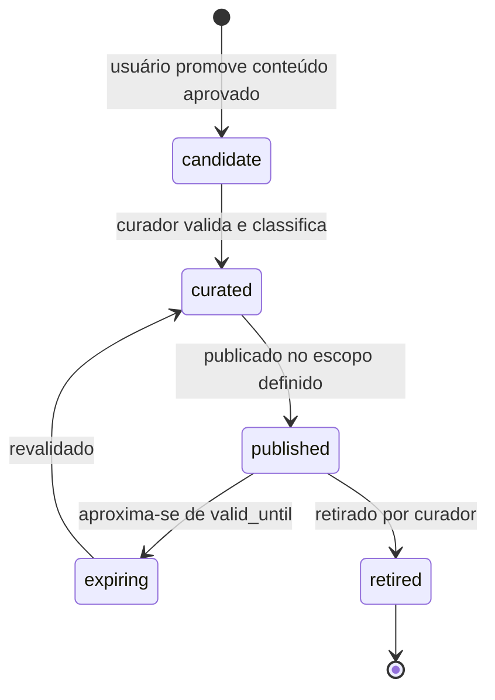

# 04 — Pipeline RAG

Este documento detalha o pipeline lógico de dez etapas da proposta (§6.4), com as
decisões de implementação e os parâmetros iniciais.

## 1. Visão do pipeline

```mermaid
flowchart LR
    subgraph Indexacao["Indexação (assíncrona)"]
        I1[Receber e validar] --> I2[Extrair e normalizar]
        I2 --> I3[Classificar e enriquecer metadados]
        I3 --> I4[Segmentar por estrutura]
        I4 --> I5[Embeddings + índice léxico]
    end
    subgraph Consulta["Consulta (síncrona)"]
        Q1[Reescrever consulta] --> Q2[Filtro de autorização]
        Q2 --> Q3[Busca híbrida]
        Q3 --> Q4[Fusão RRF]
        Q4 --> Q5[Reranking cross-encoder]
        Q5 --> Q6[Expansão small-to-big]
        Q6 --> Q7[Montagem de contexto]
    end
    subgraph Geracao["Geração e controle"]
        G1[Geração estruturada] --> G2[Verificação de suporte]
        G2 --> G3[Registro e auditoria]
        G3 --> G4[Revisão humana por criticidade]
    end
    I5 -.-> Q2
    Q7 --> G1
```



A etapa **Q2 vem antes de Q3**. Essa ordem é a invariante I-1 e não é negociável por
motivo de desempenho: filtrar depois de buscar significa que o conteúdo não
autorizado foi lido, ranqueado e trafegou pelo processo — e um bug de ordenação vira
vazamento.

## 2. Extração e normalização

### 2.1 Cascata de extração

Detalhada em [02 §4](02-stack-tecnologico.md). O que importa aqui é o que a extração
**preserva**:

| Elemento preservado | Por quê |
|---|---|
| Número da página | Âncora mínima de CA-004 |
| Offsets de caractere no texto da página | Permite destacar o trecho exato, não a página inteira |
| Coordenadas do bloco (quando disponíveis) | Permite destaque visual sobre o PDF renderizado |
| Hierarquia de títulos | Base do chunking estrutural |
| Confiança por página | Alimenta o rótulo de qualidade e o alerta ao usuário |

### 2.2 Normalização

Operações aplicadas ao texto **indexado**, nunca ao texto exibido — o usuário sempre
vê o original:

- União de hifenização de quebra de linha (`consti-\nutucional` → `constitucional`)
- Remoção de cabeçalhos e rodapés repetidos, detectados por recorrência entre páginas
- Normalização de espaços, aspas tipográficas e travessões
- Reconhecimento e marcação de citações normativas (`art. 5º, II, CF`), números de
  processo (padrão CNJ) e datas, gravados em `metadata` para busca por metadado
- **Preservação** de numeração de artigos, incisos e alíneas: são âncoras de sentido
  jurídico e não devem ser tratadas como ruído

## 3. Chunking

### 3.1 Estratégia

A proposta pede segmentação "de acordo com estrutura jurídica e documental, evitando
cortes arbitrários" (§6.4). Traduzindo em algoritmo — cascata, do mais estruturado ao
mais genérico:

1. **Chunking estrutural**, quando a estrutura é detectável. Para decisões judiciais:
   ementa, relatório, fundamentação, dispositivo. Para petições: preâmbulo, fatos,
   fundamentos, pedidos. Para contratos: cláusulas.
2. **Chunking por hierarquia de títulos**, quando há títulos mas não padrão jurídico
   reconhecido.
3. **Chunking recursivo por separadores** (parágrafo → sentença), como último recurso.

### 3.2 Parâmetros iniciais

| Parâmetro | Valor inicial | Observação |
|---|---|---|
| Tamanho do chunk filho | 400–600 tokens | Unidade de busca |
| Sobreposição | 12 % | Reduz corte de sentido na fronteira |
| Tamanho do chunk pai | 1.500–2.500 tokens | Unidade entregue ao modelo |
| Tamanho mínimo | 80 tokens | Abaixo disso, funde com o vizinho |
| Tamanho máximo absoluto | 1.000 tokens | Corte forçado com sobreposição maior |

Valores iniciais, a serem calibrados contra o conjunto de avaliação na Sprint 2.
Chunking é o parâmetro com maior efeito sobre a qualidade da recuperação e o que mais
varia por tipo documental; fixá-lo sem medir seria arbitrário.

### 3.3 Small-to-big

Busca-se sobre o filho, entrega-se o pai. O filho é semanticamente denso — o que faz o
vetor discriminar bem. O pai carrega o contexto — o que faz o modelo entender. As
âncoras de citação apontam para o **filho**, para que o destaque exibido ao revisor
seja preciso.

## 4. Indexação vetorial e léxica

| Aspecto | Decisão |
|---|---|
| Modelo | Ver [02 §5.2](02-stack-tecnologico.md); dimensão 1024 |
| Métrica | Cosseno |
| Índice | HNSW (`m=16`, `ef_construction=64`), `ef_search` ajustado em teste de carga |
| Índice léxico | `tsvector` em português com `unaccent` (GIN) |
| Aproximado | Trigram GIN, para grafias divergentes de nomes de partes |
| Reindexação | Job incremental com índice sombra e troca atômica |
| Versionamento | `embedding_model_id` + `embedding_version` por chunk |

**Sobre o texto que é embeddado.** Não é o chunk cru. É o chunk precedido de um
cabeçalho contextual curto e determinístico: tipo documental, título do documento,
data e seção. Isso resolve o problema clássico de chunks que perdem o referente
("o réu alega...", sem indicação de qual documento e qual réu). O cabeçalho é gerado
por regra, não por LLM — precisa ser reprodutível na reindexação.

## 5. Recuperação

### 5.1 Filtro de autorização (Q2)

Todo caminho de recuperação passa por uma única função:

```python
def build_authorized_filter(ctx: RequestContext, spec: RetrievalSpec) -> SQLFilter:
    """Único ponto onde o escopo de recuperação é decidido.

    Nenhuma busca no sistema pode ser executada sem passar por aqui.
    Verificado por lint arquitetural no CI.
    """
```

O filtro compõe, sempre, e nesta ordem:

1. `org_id = ctx.org_id`, do token validado — nunca de parâmetro do cliente
2. Escopo permitido (`matter_document` do caso corrente, `knowledge_asset` autorizado,
   `external_source` licenciado para a organização)
3. Pertencimento do usuário ao caso (`matter_member`)
4. **Negação por barreira ética**, que vence qualquer concessão anterior
5. Nível de sigilo compatível com o papel
6. Validade temporal do ativo institucional (`valid_until`)
7. Filtros de negócio pedidos pelo usuário (área, jurisdição, período)

A RLS reaplica os itens 1 a 4 no banco. Redundância proposital.

### 5.2 Busca híbrida (Q3, Q4)

```sql
WITH dense AS (
    SELECT id, ROW_NUMBER() OVER (ORDER BY embedding <=> :qvec) AS rank
      FROM chunk
     WHERE /* filtro autorizado */
     ORDER BY embedding <=> :qvec
     LIMIT 50
),
lexical AS (
    SELECT id, ROW_NUMBER() OVER (
             ORDER BY ts_rank_cd(tsv, websearch_to_tsquery('portuguese', :q)) DESC) AS rank
      FROM chunk
     WHERE /* mesmo filtro autorizado */
       AND tsv @@ websearch_to_tsquery('portuguese', :q)
     LIMIT 50
)
SELECT COALESCE(d.id, l.id) AS chunk_id,
       COALESCE(1.0/(60 + d.rank), 0) + COALESCE(1.0/(60 + l.rank), 0) AS rrf_score
  FROM dense d FULL OUTER JOIN lexical l USING (id)
 ORDER BY rrf_score DESC
 LIMIT 30;
```

Fusão por *Reciprocal Rank Fusion*, com constante 60. RRF combina rankings sem exigir
calibração de escalas entre pontuações de natureza diferente — é robusto e não tem
hiperparâmetro sensível, o que importa quando não há dados de treino para ajustar
pesos. A justificativa completa está em
[ADR-0005](../adr/0005-busca-hibrida-rrf-e-reranking.md).

### 5.3 Reescrita de consulta (Q1)

Quando a consulta vem de linguagem natural, uma etapa barata de reescrita gera de 2 a
4 variações: expansão de siglas, forma jurídica canônica do termo e decomposição de
perguntas compostas. As variações são buscadas em paralelo e fundidas no mesmo RRF.

Limites: a reescrita **não** pode introduzir termos que não derivem da consulta ou dos
metadados do caso, e a consulta original sempre participa da fusão. Reescrita
agressiva desloca a busca do que o usuário pediu — o pior modo de falha em um sistema
onde o usuário precisa confiar no que vê.

### 5.4 Reranking (Q5)

Cross-encoder sobre os 30 candidatos, retornando os `k` melhores (inicialmente 8 para
geração de bloco, 12 para pesquisa exploratória). O cross-encoder lê consulta e trecho
juntos, o que captura relevância que o vetor sozinho perde.

Se o reranker estiver indisponível, o sistema degrada para a ordem do RRF e registra
a degradação no trace — sem interromper o trabalho, porque a perda é de qualidade e
não de correção.

### 5.5 Montagem de contexto (Q7)

| Regra | Motivo |
|---|---|
| Orçamento de tokens por tier, com margem para a saída | Controle de custo e de latência |
| Deduplicação por sobreposição de span | Evita pagar duas vezes pelo mesmo texto |
| Cada trecho recebe um identificador estável (`[E1]`, `[E2]`) | O modelo cita o identificador; o sistema resolve para a âncora real |
| Trechos agrupados por base (`caso` / `interno` / `externo` / `jurimetria`) | §11.2 exige separação explícita de origem |
| Ordem: mais relevante no início e no fim | Mitiga a degradação de atenção no meio do contexto |
| Nenhum trecho entra sem `chunk_id` resolvível | Torna impossível citar algo inexistente |

A citação por identificador em vez de texto livre é o detalhe que fecha CA-001: o
modelo não *escreve* uma referência, ele *seleciona* uma que já existe. Referência
inventada deixa de ser possível por construção — se o identificador não estiver na
lista entregue, a validação de schema rejeita a saída.

## 6. As quatro bases e suas regras

| Base | `scope` | Regras de recuperação |
|---|---|---|
| Documentos do caso | `matter_document` | Filtrado por `matter_id`; nunca cruza casos; sempre disponível ao membro do caso |
| Conhecimento interno | `knowledge_asset` | Só ativos aprovados, dentro da validade, no escopo de área e sigilo autorizados |
| Fontes jurídicas externas | `external_source` | Só fontes licenciadas para a organização; citação preserva identificador oficial |
| Base jurimétrica | — | **Não entra no RAG.** Consultada pela camada analítica; resultados podem ser injetados como contexto já calculado |

A última linha merece destaque: a base jurimétrica não é recuperada semanticamente
para produzir números. Se fosse, o modelo poderia "contar" decisões recuperadas e
apresentar frequências — exatamente o que §7.5 proíbe. A separação é arquitetural.

## 7. Ciclo de vida do ativo institucional



- Promoção é **sempre** ato humano explícito (§4.8: "a aprovação não deve ser
  presumida").
- Somente `published` dentro da validade é recuperável.
- Retirada remove o chunk do índice na mesma transação — não em job noturno. Ativo
  retirado que continua sendo recuperado é uma falha de governança visível ao usuário.
- Cada ativo carrega origem, autor, aprovador, área, validade, sigilo e escopo de
  reutilização, conforme §5.9.

## 8. Parâmetros consolidados

| Parâmetro | Valor inicial | Onde calibrar |
|---|---|---|
| `top_k` denso | 50 | Sprint 2 |
| `top_k` léxico | 50 | Sprint 2 |
| Constante RRF | 60 | Padrão robusto; revisar só com evidência |
| Candidatos ao reranker | 30 | Trade-off custo × recall |
| `k` final para geração de bloco | 8 | Sprint 4 |
| `k` final para pesquisa | 12 | Sprint 4 |
| `ef_search` HNSW | 100 | Teste de carga, Sprint 3 |
| Orçamento de contexto | Por tier | [09 §5](09-observabilidade-custos-e-avaliacao.md) |
| Limiar de relevância mínima | Definido pela curva de precisão/recall | Sprint 2 |

## 9. Reindexação sem downtime

Trocar modelo de embedding ou estratégia de chunking exige reindexar. O procedimento:

1. Nova versão recebe `embedding_version = N+1`.
2. Job reindexa em background, gravando chunks novos ao lado dos antigos.
3. Consultas continuam usando `N` até a conclusão.
4. Verificação: conjunto de avaliação roda contra `N+1`; se as métricas regredirem
   além do limiar, a troca é abortada.
5. Troca atômica da versão ativa por organização.
6. Chunks da versão `N` são removidos após período de carência.

O passo 4 é o que impede uma "melhoria" de silenciosamente piorar a recuperação.

## 10. Cobertura das dimensões de avaliação

As oito dimensões de §6.5 têm implementação e métrica correspondentes:

| Dimensão (§6.5) | Mecanismo | Métrica |
|---|---|---|
| Cobertura da recuperação | Híbrida + reescrita + reranking | Recall@k no conjunto anotado |
| Precisão da recuperação | Reranking + limiar de relevância | Precision@k, nDCG |
| Fidelidade | Verificador de suporte | Taxa de afirmações sustentadas |
| Completude | Checklist por tipo de bloco | Taxa de elementos obrigatórios ausentes |
| Atribuição | `evidence_link` obrigatório | Taxa de afirmações materiais com âncora resolvível |
| Abstenção | Sentinela no schema de saída | Taxa de abstenção correta em perguntas sem resposta |
| Segregação | Filtro pré-busca + RLS | Zero vazamentos na suíte adversarial (gate de CI) |
| Atualidade | `valid_until` + filtro | Taxa de recuperação de conteúdo expirado (alvo: zero) |

Detalhamento do harness em [09 §4](09-observabilidade-custos-e-avaliacao.md).

---

**Anterior**: [03 — Modelo de dados](03-modelo-de-dados.md) · **Próximo**: [05 — Comportamento da IA e guardrails](05-comportamento-da-ia-e-guardrails.md)
