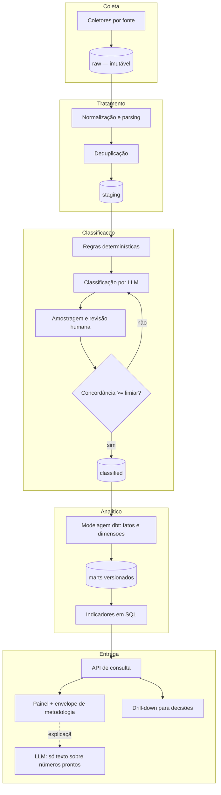

# 06 — Jurimetria

## 1. Premissa que organiza este documento

A proposta é categórica (§7.5):

> A LLM pode explicar um indicador, mas não deve inventar percentuais nem calcular
> estatísticas a partir de uma recuperação ocasional de documentos. Os cálculos
> pertencem à camada analítica estruturada.

Tecnicamente, isso significa que a jurimetria **não é uma funcionalidade de IA**. É um
pipeline de dados com controle de qualidade estatística, ao qual a IA presta dois
serviços auxiliares e bem delimitados: **classificar** documentos (sob validação humana
medida) e **explicar** resultados já calculados. Nada além.

Essa é também a razão pela qual a proposta afirma que a jurimetria não deve ficar sob
responsabilidade exclusiva do engenheiro de IA. A concordância é técnica: o trabalho
crítico aqui é de engenharia de dados e de metodologia estatística, com validação
jurídica. Ver [11 §1](11-estimativa-esforco-e-sprints.md).

## 2. Arquitetura do pipeline



Quatro camadas de persistência, com fronteiras claras: `raw` nunca é alterada,
`staging` é reconstruível, `classified` carrega proveniência de cada rótulo, `marts`
são versionados e imutáveis por versão.

## 3. Coleta

### 3.1 Fontes candidatas

| Fonte | Natureza | Considerações |
|---|---|---|
| API pública de dados processuais do CNJ | Metadados e movimentações | Boa cobertura de metadados; **não** entrega o inteiro teor das decisões |
| Portais e serviços dos tribunais | Inteiro teor e ementas | Cobertura e estabilidade variam por tribunal |
| Diários da justiça eletrônicos | Publicações | Útil para marcos temporais |
| Bases jurídicas licenciadas | Inteiro teor tratado | Melhor qualidade; custo e restrição contratual de uso |
| Acervo do próprio escritório | Decisões dos casos | Alta qualidade, amostra enviesada por construção |

**A definir antes da Sprint 6, por decisão jurídica e comercial**: quais fontes serão
usadas, sob qual licença e com qual permissão de armazenamento e reprocessamento.
Nenhuma coleta começa sem parecer. O tratamento de dados pessoais presentes em
decisões — inclusive de terceiros que não são parte no caso do escritório — precisa de
base legal definida e de política de minimização; isso é analisado em
[07 §6](07-seguranca-e-privacidade.md).

### 3.2 Padrão do coletor

Cada fonte é um coletor com a mesma interface:

```python
class Collector(Protocol):
    source_id: str
    def discover(self, window: DateRange) -> Iterator[DocumentRef]: ...
    def fetch(self, ref: DocumentRef) -> RawDocument: ...
    def rate_limit(self) -> RateLimitPolicy: ...
```

Requisitos comuns a todos os coletores:

- Coleta incremental por janela temporal, com marca-d'água persistida
- Respeito a limites de taxa e aos termos de uso da fonte
- Registro de cada requisição: URL, timestamp, status, hash da resposta
- Armazenamento do documento bruto **exatamente como recebido**, para reprocessamento
- Falha de coleta não interrompe o lote; entra em relatório de cobertura

O último ponto é essencial para a honestidade metodológica: **cobertura incompleta
precisa ser mensurada, não escondida**. Se o coletor obteve 8.412 de 9.100 decisões
esperadas na janela, o número 8.412 e a taxa de 92,4 % aparecem no envelope de
metodologia.

## 4. Tratamento

| Etapa | Operação |
|---|---|
| Parsing | Extração de campos estruturados: tribunal, órgão, classe, assunto, datas, relator, resultado declarado |
| Normalização | Nomes de órgãos, classes e assuntos contra tabelas de referência (CNJ) |
| Segmentação | Separação de ementa, relatório, fundamentação e dispositivo |
| Deduplicação | Hash exato + similaridade (MinHash) para versões e republicações |
| Tratamento de ausência | Campo ausente é `NULL` explícito, **nunca** imputado silenciosamente |
| Anonimização | Aplicada conforme política; segredo de justiça exclui o documento da base |

A regra de ausência merece ênfase: imputar valor faltante em base jurimétrica produz
indicadores que parecem melhores e são piores. `NULL` propaga e aparece no envelope
como percentual de dados ausentes.

## 5. Classificação

### 5.1 Estratégia em três camadas

1. **Regras determinísticas** primeiro. Muitos campos são extraíveis por padrão
   textual: número CNJ, datas, valores, tipo de recurso. O que regra resolve, LLM não
   precisa tocar — é mais barato, mais rápido e reprodutível.
2. **LLM com saída estruturada** para o que exige compreensão: resultado
   (procedente / parcialmente procedente / improcedente / extinto sem mérito),
   fundamentos invocados, teses reconhecidas, tipos de prova considerados.
3. **Revisão humana em amostra**, com concordância medida.

### 5.2 Validação da classificação

Aqui está a diferença entre jurimetria e estatística decorativa.

| Item | Definição |
|---|---|
| Amostra de validação | Mínimo de 300 decisões por variável, estratificada por tribunal e período |
| Anotadores | Ao menos dois, com especialização jurídica na área |
| Concordância entre humanos | Kappa de Cohen; abaixo de 0,70 indica que a **definição da variável** é ambígua, não que os anotadores erraram |
| Concordância LLM × humano | Kappa e F1 por classe |
| Limiar de aceitação | Kappa ≥ 0,75 e F1 ≥ 0,85 por classe para a variável entrar em produção |
| Classes desbalanceadas | Reportar métrica por classe, nunca só acurácia global |
| Reavaliação | A cada mudança de modelo, prompt ou fonte |

Variável que não atinge o limiar **não é publicada**. Ela aparece na interface como
"em validação", com o motivo. Publicar variável mal classificada contamina todos os
indicadores derivados dela e destrói a confiança no módulo inteiro — que é
precisamente o risco "dados jurimétricos incompletos" da proposta (§16.1).

### 5.3 Proveniência do rótulo

Cada rótulo carrega como foi produzido:

```sql
CREATE TABLE decision_label (
    decision_id     uuid NOT NULL,
    variable        text NOT NULL,
    value           text,
    method          text NOT NULL CHECK (method IN ('rule','llm','human','llm_human_confirmed')),
    confidence      real,
    model_id        text,
    prompt_version  int,
    labeled_by      uuid,
    labeled_at      timestamptz NOT NULL DEFAULT now(),
    dataset_version_id uuid NOT NULL,
    PRIMARY KEY (decision_id, variable, dataset_version_id)
);
```

Permite responder, para qualquer indicador: quantas das decisões que o compõem foram
classificadas por humano, quantas por modelo, e com que confiança. Essa proporção
entra no envelope.

## 6. Camada analítica

### 6.1 Modelagem

Modelo dimensional em schema dedicado, transformações em dbt (versionadas, testadas,
com linhagem):

```
dim_court           tribunal, órgão julgador, competência, UF
dim_subject         classe, assunto, área
dim_time            data, mês, trimestre, ano
dim_thesis          tese catalogada, requisitos
fct_decision        grão: uma decisão
                    FKs para dimensões; resultado; datas de marcos;
                    valores; duração; flags de qualidade; dataset_version_id
fct_appeal          grão: um recurso; resultado; reforma/manutenção
```

Testes dbt obrigatórios: unicidade de chave, integridade referencial, domínio de
valores categóricos, faixa plausível de datas e valores, taxa máxima de `NULL` por
coluna crítica.

### 6.2 Indicadores em SQL

```sql
-- Distribuição de resultados no recorte, com amostra e cobertura.
SELECT
    d.result,
    COUNT(*)                                        AS n,
    ROUND(100.0 * COUNT(*) / SUM(COUNT(*)) OVER (), 1) AS pct,
    COUNT(*) FILTER (WHERE l.method IN ('human','llm_human_confirmed')) AS n_human_validated
FROM fct_decision d
JOIN decision_label l
  ON l.decision_id = d.decision_id
 AND l.variable = 'result'
 AND l.dataset_version_id = :dataset_version
WHERE d.court_id = :court
  AND d.subject_id = :subject
  AND d.decided_on BETWEEN :from AND :to
  AND d.dataset_version_id = :dataset_version
GROUP BY d.result
ORDER BY n DESC;
```

Toda consulta é parametrizada e **sempre** filtra por `dataset_version_id`. Sem isso
não há reprodutibilidade (CA-009): o mesmo filtro executado depois de uma nova coleta
retornaria número diferente sem que nada tivesse mudado na pergunta.

Indicadores de duração usam mediana e intervalo interquartil, não média. Duração
processual tem cauda longa; média isolada é enganosa e a proposta pede transparência,
não impressão.

### 6.3 Reprodutibilidade

```python
@dataclass(frozen=True)
class JurimetricQuery:
    indicator: str
    filters: dict[str, Any]
    dataset_version_id: UUID
    method_version: str

    def fingerprint(self) -> str:
        return sha256(canonical_json(asdict(self))).hexdigest()
```

A impressão digital é persistida com o resultado. Reexecutar a mesma consulta sobre o
mesmo dataset com a mesma versão de método precisa produzir o mesmo número, bit a bit
— e há teste de CI que verifica isso.

## 7. Envelope de metodologia

CA-008 exige que todo indicador exiba amostra, período, filtros, fonte e data de
atualização. O envelope é parte do **tipo de retorno**, não decoração de interface:

```python
class MethodologyEnvelope(BaseModel):
    sample_total: int
    sample_classified: int
    sample_human_validated: int
    period_from: date
    period_to: date
    last_updated_at: datetime
    sources: list[SourceDescriptor]
    inclusion_criteria: list[str]
    exclusion_criteria: list[str]
    dedup_method: str
    missing_data_pct: float
    classification_quality: dict[str, ClassificationMetrics]  # kappa, F1 por variável
    coverage_estimate_pct: float | None
    limitations: list[str]
    dataset_version_id: UUID
    method_version: str

class IndicatorResult(BaseModel):
    indicator: str
    values: list[IndicatorValue]
    methodology: MethodologyEnvelope        # obrigatório
    drilldown_token: str                    # acesso às decisões — CA-026
```

Não existe caminho de código que retorne indicador sem envelope: o modelo Pydantic o
exige. Um endpoint que tentasse omiti-lo não compila conceitualmente — falha na
validação de resposta, e há teste de contrato que garante isso.

### 7.1 Limitações obrigatórias

Aparecem sempre, mesmo quando os dados são bons, porque a ausência do aviso é lida
como ausência do problema:

- Viés de publicação: nem toda decisão é publicada ou acessível
- Cobertura incompleta da fonte no período
- Mudanças de competência e de composição de órgãos ao longo do tempo
- Heterogeneidade dos casos sob a mesma classe processual
- Correlação não demonstra causalidade
- **O indicador descreve um conjunto observado; não prevê o resultado de um caso
  individual**

O último item é o mais importante do produto inteiro, do ponto de vista de risco. Ele
aparece com destaque visual permanente no painel, não em nota de rodapé. O teste de
usabilidade de §13.4 mede se o usuário interpreta frequência como certeza; se
interpretar, o design mudou.

## 8. Papel da LLM

| Uso | Permitido? |
|---|---|
| Classificar decisões, com validação humana medida | Sim |
| Extrair campos de texto não estruturado | Sim, com verificação determinística quando possível |
| Explicar em linguagem natural um indicador já calculado | Sim |
| Ajudar a navegar filtros e sugerir recortes | Sim |
| Resumir uma decisão específica que o usuário abriu | Sim |
| **Calcular ou estimar percentuais, médias ou frequências** | **Não** |
| **Responder pergunta quantitativa sem passar pela camada analítica** | **Não** |
| **Prever resultado de caso individual** | **Não** |

Imposição técnica: o contexto entregue ao modelo na etapa de explicação contém o
**resultado agregado e o envelope**, não a lista de decisões. Sem os dados brutos, não
há o que contar. É a mesma lógica do §7.5 aplicada ao formato do prompt.

Além disso, perguntas quantitativas feitas em linguagem natural são roteadas para um
tradutor consulta-natural → consulta-parametrizada, que só consegue emitir consultas
de um catálogo fechado de indicadores. Se a pergunta não mapeia para nenhum indicador
disponível, a resposta é "este indicador não está disponível no recorte atual" — e não
uma estimativa.

## 9. Recorte do MVP

Seguindo §7.6, o MVP jurimétrico é deliberadamente estreito:

| Dimensão | Recorte |
|---|---|
| Área | Uma, alinhada à área da peça prioritária |
| Tribunais | Um tribunal ou conjunto pequeno de órgãos |
| Classe/assunto | Uma, com volume e padronização suficientes |
| Período | 24 a 36 meses |
| Indicadores | 3 a 5 de alto valor |
| Variáveis classificadas | 3 a 4, todas validadas manualmente |
| Volume-alvo | 3.000 a 10.000 decisões tratadas |

Indicadores prioritários sugeridos: distribuição de resultados; duração mediana entre
marcos; frequência de concessão da medida relevante à área; frequência dos fundamentos
mais recorrentes. Todos com drill-down.

## 10. Critério de interrupção

A jurimetria é o componente com maior risco de dado. Por isso tem gate próprio,
avaliado ao final da Sprint 8, **antes** de investir na interface do painel:

| Condição | Resultado |
|---|---|
| Cobertura da fonte ≥ 80 % do esperado no recorte | Prossegue |
| Kappa ≥ 0,75 nas variáveis principais | Prossegue |
| Dados ausentes < 20 % nos campos críticos | Prossegue |
| Volume ≥ 3.000 decisões no recorte | Prossegue |
| **Qualquer condição não atendida** | **Jurimetria sai do MVP** |

Se sair, o restante do produto permanece íntegro — a arquitetura não acopla a
jurimetria ao fluxo de produção de peças — e o esforço é redirecionado para
aprofundar RAG e qualidade. Essa é a decisão de recorte que a própria proposta pede
("o primeiro incremento precisa ser preciso").

---

**Anterior**: [05 — Comportamento da IA](05-comportamento-da-ia-e-guardrails.md) · **Próximo**: [07 — Segurança e privacidade](07-seguranca-e-privacidade.md)
