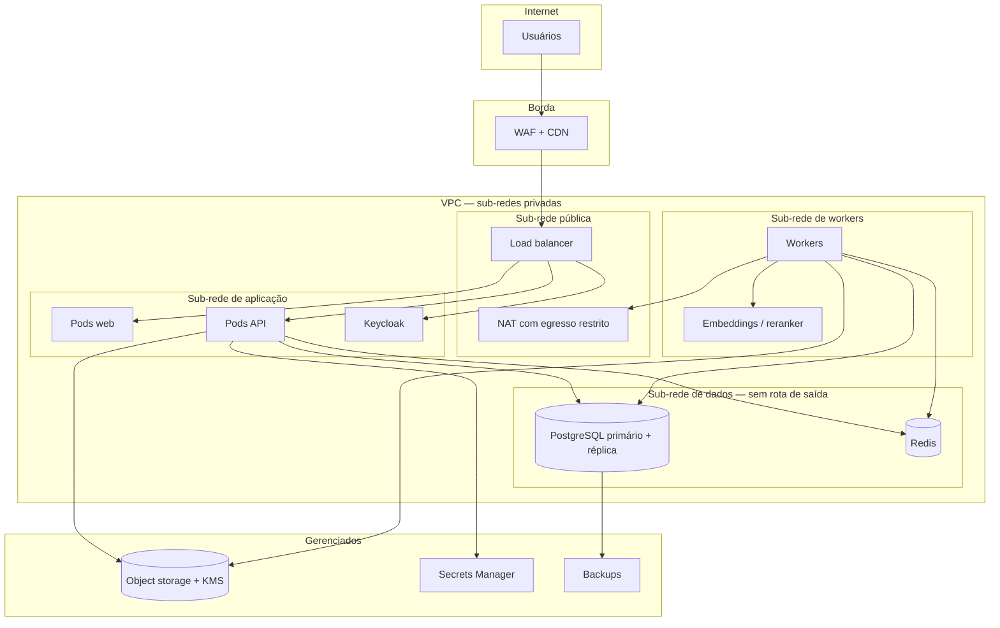

# 10 — Infraestrutura, CI/CD e ambientes

## 1. Topologia



Decisões que valem registro:

- **A sub-rede de dados não tem rota de saída.** Um banco comprometido não consegue
  exfiltrar por conta própria; precisaria antes comprometer a camada de aplicação.
- **Egresso passa por NAT com lista de permissão.** Provedores de LLM, fontes
  jurídicas e serviços contratados; nada além. É o controle de rede que sustenta a
  política de saída de conteúdo ([07 §5](07-seguranca-e-privacidade.md)).
- **GPU em pool separado** dos workers de CPU: escalam por gatilhos diferentes e têm
  custos muito distintos.

## 2. Região e residência de dados

Preferência por região brasileira para banco, storage, workers e observabilidade —
tanto por latência quanto por simplificar a análise de transferência internacional na
LGPD.

A restrição real está nos **provedores de LLM**: nem todo modelo está disponível em
todas as regiões. O tratamento é o seguinte, e é decisão consciente e não omissão:

1. Tiers de alto volume (`classification`, `extraction`, `verification`) rodam em
   **modelos autogerenciados na região brasileira** — o que mantém no país o volume
   maior de conteúdo confidencial.
2. Tiers de maior capacidade (`generation`, `reasoning`) podem usar provedores
   comerciais, sujeitos à política de egresso da organização, a contrato com retenção
   zero e a registro por chamada.
3. Organizações que exijam residência total operam **somente** com modelos
   autogerenciados, com perda mensurável de qualidade nos tiers altos — e essa perda
   deve ser medida e comunicada comercialmente, não escondida.

A disponibilidade regional de cada provedor é verificada na contratação, não presumida
aqui.

## 3. Ambientes

| Ambiente | Finalidade | Dados | Acesso |
|---|---|---|---|
| `local` | Desenvolvimento | Sintéticos | Desenvolvedor |
| `ci` | Testes automatizados | Sintéticos, efêmeros | Pipeline |
| `preview` | Um por PR, efêmero | Sintéticos | Time |
| `staging` | Homologação, ensaio de release | Sintéticos ou anonimizados irreversivelmente | Time + produto |
| `production` | Uso real | Reais | Restrito, com aprovação e auditoria |

**Dados reais nunca saem de produção** (§10.2). Restaurar um dump de produção em
homologação para "reproduzir um bug" é a violação mais comum dessa regra e está
proibida por política e por controle técnico: as credenciais de produção não são
acessíveis a partir dos demais ambientes.

Para depurar com dados reais, o caminho é acesso temporário e auditado a produção, com
aprovação registrada — inconveniente por projeto.

## 4. Infraestrutura como código

| Camada | Ferramenta |
|---|---|
| Recursos de nuvem | Terraform, estado remoto com bloqueio |
| Kubernetes | Helm charts versionados |
| Configuração de aplicação | ConfigMaps + Secrets do Secrets Manager |
| Banco | Alembic, executado como job de pré-deploy |
| Modelos e prompts | Versionados no repositório, promovidos por ambiente |

Regra: **nenhuma alteração manual em produção**. Mudança fora do IaC é detectada por
verificação de deriva e revertida. A exceção é resposta a incidente, que exige registro
posterior e correção no código.

## 5. Pipelines

### 5.1 Integração contínua

```yaml
on: [pull_request]
jobs:
  qualidade:      # ruff, mypy --strict, eslint, tsc, verificação de formatação
  seguranca:      # SAST, varredura de segredos, dependências, licenças
  testes:         # unitários; integração com Postgres real; contrato de API
  isolamento:     # suíte adversarial cross-tenant — falha bloqueia o merge
  eval-smoke:     # conjunto reduzido, quando o PR toca IA
  build:          # imagens, scan, SBOM, assinatura
  preview:        # ambiente efêmero com dados sintéticos
```

### 5.2 Entrega contínua

```yaml
on: [push: main]
jobs:
  eval-completo:  # sete conjuntos; compara com o baseline
  deploy-staging: # migração + rollout + smoke E2E
  aprovacao:      # manual, com checklist de release
  deploy-prod:    # migração + rollout canário (10% → 50% → 100%)
  verificacao:    # métricas de saúde e de qualidade por 30 min
  rollback-auto:  # se erro ou latência estourarem o limiar
```

### 5.3 Migrações

Migração destrutiva é feita em **duas etapas separadas por release**: primeiro
compatibilidade (adiciona a nova coluna, escreve nas duas, lê da antiga); depois
remoção (lê da nova, remove a antiga). Isso permite rollback do código sem rollback do
banco — que é o cenário em que releases costumam se transformar em incidentes longos.

## 6. Multi-tenancy e tier dedicado

| Tier | Topologia | Quando |
|---|---|---|
| `shared` | Banco compartilhado com RLS; storage compartilhado com prefixo e chave por organização | Padrão |
| `dedicated` | Banco próprio, namespace próprio, chave KMS própria, possível VPC própria | Exigência contratual do escritório |

O código é o mesmo; muda o *routing* de conexão e a configuração de infraestrutura.
Isso é viável porque `org_id` está presente em toda tabela desde o início — retrofit
posterior seria caro.

**Custo do tier dedicado**: infraestrutura própria por cliente, janela de manutenção
própria, e trabalho de release multiplicado por instância. Deve ser precificado, e a
decisão é comercial ([00 §4.3](00-sumario-executivo.md)). A recomendação técnica é
limitar o número de instâncias dedicadas e automatizar completamente o provisionamento
antes da primeira venda nesse tier.

## 7. Backup e recuperação

| Item | Política |
|---|---|
| Banco | PITR contínuo + snapshot diário; retenção de 30 dias |
| Object storage | Versionamento + replicação entre zonas; Object Lock na auditoria |
| Segredos | Backup do cofre, com custódia separada |
| Configuração | No repositório, por definição |
| Restauração | Teste trimestral, com relatório e verificação de isolamento pós-restore |
| RPO / RTO | 15 min / 4 h no piloto; revisar para produção operacional |

O teste de restauração inclui verificar que os dados restaurados continuam isolados
por organização. Restauração que quebra isolamento é vazamento com etapa extra.

## 8. Escalabilidade

| Componente | Estratégia | Gatilho |
|---|---|---|
| Web e API | Horizontal, sem estado | CPU e requisições por segundo |
| Workers de ingestão | Horizontal por fila | Profundidade da fila |
| Workers de geração | Horizontal, limitado por cota de provedor | Profundidade da fila |
| Embeddings / reranker | Vertical primeiro, depois horizontal | Utilização de GPU |
| PostgreSQL | Vertical + réplicas de leitura | CPU, IOPS, atraso de replicação |
| Índice vetorial | Ajuste de HNSW; particionamento se necessário | Latência de busca |

Os quatro pontos de tensão previsíveis, em ordem provável de aparecimento: índice
vetorial em organizações com acervo grande; cota do provedor de LLM sob uso
concorrente; GPU sob ingestão em lote; conexões do Postgres sob muitos workers
(mitigado com PgBouncer desde o início).

## 9. Runbooks

Obrigatórios antes do piloto:

- Fila travada / *dead letter queue* crescendo
- Provedor de LLM degradado ou fora
- Latência de busca acima do limiar
- Falha de integridade da cadeia de auditoria
- Suspeita de vazamento entre organizações — **procedimento de severidade máxima**
- Custo anômalo em uma organização
- Restauração de banco
- Rollback de release
- Rotação de segredo comprometido

Cada runbook: sintoma, diagnóstico, mitigação imediata, correção definitiva,
comunicação. Alerta sem runbook não entra em produção.

---

**Anterior**: [09 — Observabilidade, custos e avaliação](09-observabilidade-custos-e-avaliacao.md) · **Próximo**: [11 — Estimativa de esforço e sprints](11-estimativa-esforco-e-sprints.md)
